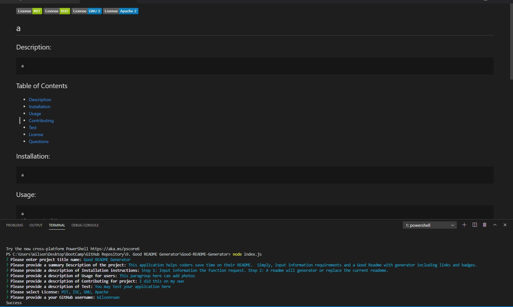

  
# Good README Generator

## Description:
    This application will help coders save time by input information to the rather than creating a README.  

## Table of Contents

- [Description](#description)
- [Installation](#installation)
- [Usage](#usage) 
- [Contributing](#contributing)
- [Test](#test)
- [License](#license) 
- [Questions](#questions)

## Installation:
    To use this application, first you will need to clone or download the codes from my GitHub and then run your terminal on the app.  Then, type “npm install” and then “node index.js”. 

## Usage:
    Step 1: input the following requirements and Step 2: you are done. Please see image below:

## License:
   - [MIT](https://choosealicense.com/licenses/mit/)
   - [ISC](https://choosealicense.com/licenses/isc/)

## Contributing:
    This is my own. 

## Test:
    Run the command : npm run test

## Questions: 
  - Please feel free to contact for additional questions by email below: 
  - [Email] wilsonruan23@gmail.com.
  - You may visit my GitHub Page for additional information below: 
  - [GitHub] https://github.com/Wilsonruan.
  