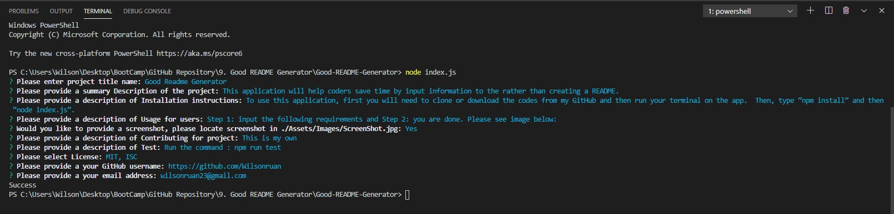

      
# ok

## Description:
    oko

## Table of Contents

- [Description](#description)
- [Installation](#installation)
- [Usage](#usage) 
- [Contributing](#contributing)
- [Test](#test)
- [License](#license) 
- [Questions](#questions)

## Installation:
    ko

## Usage:
    k

## License:
   - [MIT](https://choosealicense.com/licenses/mit/)
   - [ISC](https://choosealicense.com/licenses/isc/)
   - [GNU](https://choosealicense.com/licenses/gpl-3.0/)
   - [Apache](https://choosealicense.com/licenses/apache-2.0/)

## Contributing:
    k

## Test:
    k

## Questions: 
  - Please feel free to contact for additional questions by email below: 
  - [Email] k.
  - You may visit my GitHub Page for additional information below: 
  - [GitHub] k.
  